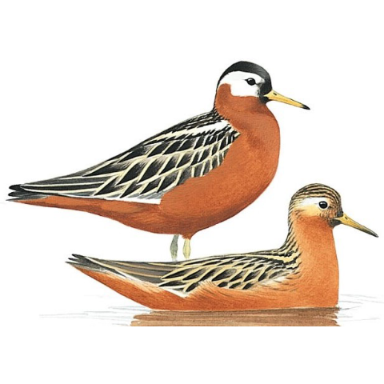

README
================

[](http://www.repostatus.org/#active)
[](https://www.gnu.org/licenses/gpl-3.0)
[](https://opensource.org/)

## To do

  - add functions to create maps

## auksRuak

Collection of functions (mainly for myself) used to analyse and
visualise spatial data from Red Phalaropes (auksruak in Inupiat). Mainly
combining data.table, sf and ggplot2.

<!-- --> Drawing by
[Killian
Mullarney](https://images-na.ssl-images-amazon.com/images/G/01/randoEMS/p193_RedPhalarope_Mullarney_lg.jpg)

### Installation

``` r
install.packages('devtools')
devtools::install_github('krietsch/auksRuak')
```
